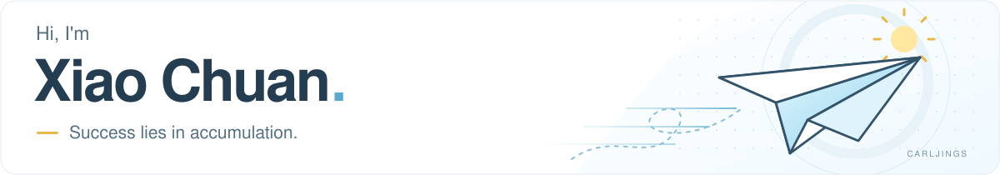
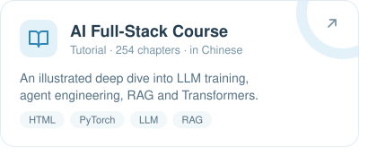
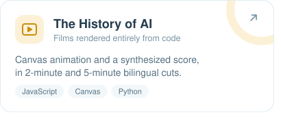
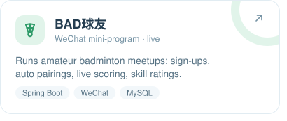
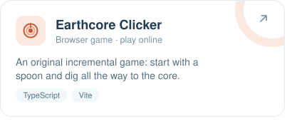
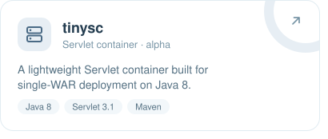
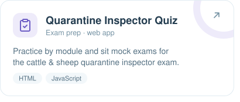

<picture>
  <source media="(prefers-color-scheme: dark)" srcset="assets/profile-banner-dark.svg">
  
</picture>

👋 Developer in Suzhou, China, working on **government big data** and building with **AI agents & LLMs**.

<a href="https://carljings.top"><picture><source media="(prefers-color-scheme: dark)" srcset="assets/ui/link-site-dark.svg"></picture></a>
<a href="https://carljings.top/blog/"><picture><source media="(prefers-color-scheme: dark)" srcset="assets/ui/link-blog-dark.svg"></picture></a>
<a href="mailto:carljings@qq.com"><picture><source media="(prefers-color-scheme: dark)" srcset="assets/ui/link-email-dark.svg"></picture></a>
<a href="https://blog.csdn.net/carljings"><picture><source media="(prefers-color-scheme: dark)" srcset="assets/ui/link-csdn-dark.svg"></picture></a>

<picture><source media="(prefers-color-scheme: dark)" srcset="assets/ui/section-projects-dark.svg"></picture>

<a href="https://carljings.top/ai/"><picture><source media="(prefers-color-scheme: dark)" srcset="assets/ui/project-ai-course-dark.svg"></picture></a>
<a href="https://github.com/carljings/ai-history-video"><picture><source media="(prefers-color-scheme: dark)" srcset="assets/ui/project-ai-history-dark.svg"></picture></a>
<a href="https://carljings.top/"><picture><source media="(prefers-color-scheme: dark)" srcset="assets/ui/project-bad-buddies-dark.svg"></picture></a>
<a href="https://carljings.top/earthcore/"><picture><source media="(prefers-color-scheme: dark)" srcset="assets/ui/project-earthcore-dark.svg"></picture></a>
<a href="https://github.com/carljings/tinysc"><picture><source media="(prefers-color-scheme: dark)" srcset="assets/ui/project-tinysc-dark.svg"></picture></a>
<a href="https://carljings.top/quiz/"><picture><source media="(prefers-color-scheme: dark)" srcset="assets/ui/project-quarantine-quiz-dark.svg"></picture></a>

Also: <a href="https://github.com/carljings/zg">zg</a>, a badminton court-slot grabber · <a href="https://carljings.top/lz/">a clean-governance study site</a> · source code for <a href="https://github.com/carljings/ai-tutorial">the AI course</a> and <a href="https://github.com/carljings/cattle-sheep-quarantine-quiz">the quiz</a>

<picture><source media="(prefers-color-scheme: dark)" srcset="assets/ui/section-stack-dark.svg"></picture>

<picture>
  <source media="(prefers-color-scheme: dark)" srcset="https://skillicons.dev/icons?i=java%2Cspring%2Cpy%2Cts%2Cjs%2Cnodejs%2Cmysql%2Cpostgres%2Cpytorch%2Cvite%2Cdocker%2Cnginx&theme=dark&perline=12">
  
</picture>

<picture><source media="(prefers-color-scheme: dark)" srcset="assets/ui/section-activity-dark.svg"></picture>
<a href="https://github.com/carljings?tab=overview">
  <picture>
    <source media="(prefers-color-scheme: dark)" srcset="https://github-stats-extended.vercel.app/api?username=carljings&show_icons=true&hide_border=true&hide_rank=true&hide_title=true&disable_animations=true&bg_color=0d1117&text_color=9DB1BF&icon_color=5CAACB">
    
  </picture>
</a>

Off the keyboard: 🏸 badminton · 🏊 swimming · 🚴 cycling
